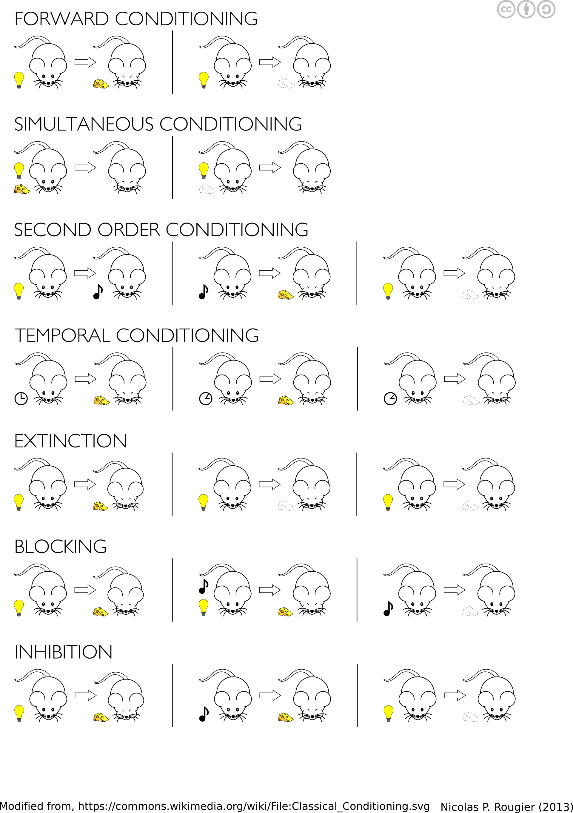

# Resources to learn "A Science of Behavior"
Edited 2020-09-11

CC BY-SA 3.0

## Content
[A Science of behavior](#a-science-of-behavior-)

[Respondent conditioning](#respondent-conditioning-)

[Operant conditioning part 1](#operant-conditioning-part-1-)

[Operant conditioning part 2](#operant-conditioning-part-2-)

[Other resources](#other-resources-)

[References](#references-)

## A Science of behavior 

### Video resources

* [B.F. Skinner - Philosophy of Behaviorism (1988)](https://www.youtube.com/watch?v=NpDmRc8-pyU)
* [Behavior analysis a natural science of behavior](https://youtu.be/_18FfTZ9_yQ)

### Memos
* Beteende: 
  - Intuitiv beskrivning: Beteende är vad en organism gör. Ex. Prata, drömma, tänka. 
  - Definition: …behavior is that part of the functioning of an organism which is engaged in acting upon or having commerce with the outside world (Skinner, 1938, p.6)
* Studera beteende vetenskapligt
  - Experimentell analys
  - Tillämpad Beteendeanalys
  - Behaviorism
* Funktion över form på beteende.
* Selektion över olika tidspann och variabler
  - Evolutionär (Phylogenetic)
  - Operant (Ontogenetic)
  - Kulturell (Memetic)

### Articles
* Catania, A. C. (2013). A natural science of behavior. Review of General Psychology, 17(2), 133–139. https://doi.org/10.1037/a0033026
* Skinner, B. F. (1984). Behaviorism at 50. Behavioral and Brain Sciences, 7(04), 655. https://doi.org/10.1017/S0140525X00027989

## Respondent conditioning 
* Namn: Respondent betinging, klassisk betingning (eng. Respondent and  classical conditioning)
### Video resources
* [Difference between classical and operant conditioning](https://youtu.be/H6LEcM0E0io)
* [Description of classical (respondent) conditioning](https://youtu.be/qaOC_3KA3P8)

### Memos
* Respondent betingning: 
  - Intuitiv beskrivning: Respondent betinging beskriver hur vi lär oss att händelser och/eller ting är relaterade till relevanta händelser.  Det som är mest "relevant" i att hjälpa oss hålla koll "predicera" på vad som kommer hända är det som kommer betingas mest. 
  - Övergripande definition av respondent betingning: “…conditioning is now described as the learning of relations among events so as to allow the organism to represent its environment” (Rescorla, 1988)
  - Definition: “…animals behave as if they have learned to associate…stimuli(S)…with biologically significant outcomes (O)…” (Bouton, 2016, p.79)
* Vad betingas ? - "Bästa prediktiorn vinner"
* 'Styrkan' i betingning
  - Latens/tid
  - Nyhet/Novelty
  - Intensitet
  - Frekevens
* Förkortningar.
  - S = Stimuli
  - O = relevant händelse för organismen
  - R = Respons
  - OBS = obetingad stimuli, eng. US or UCS
  - OBR = obetingad Respons, eng. UR or UCR
  - BS = Betingat stimuli, eng. CS
  - BR = Betingad respons, eng. CR
  - BS+ = betingad stimuli som blivit betingad till en händelse
  - BS- = betingat stimuli som blivit betingad till frånvaron av händelse

### Articles
* Rescorla, R. a. (1988). Pavlovian conditioning. It’s not what you think it is. The American Psychologist, 43(3), 151–160. https://doi.org/10.1037/0003-066X.43.3.151

## Operant conditioning part 1 
* Namn: Operant betinging, instrumentell betingning (eng. operant and instrumental conditioning)

### Video resources
* [Difference between classical and operant conditioning](https://youtu.be/H6LEcM0E0io)
* [What is reinforcers and punishers?](https://www.youtube.com/watch?v=c2r1uSHgRIo&ab_channel=ByPassPublishing)

### Memos
* Operant betingning
  - Intuitiv beskrivning: Beteende påverkas av konsekvenserna som följer. En konsekvens kan vara att något följer beteendet (någon svarar när jag säger "hej"). Men det kan också vara att något uteblir (när jag ber om ursäkt blir personen mindre arg).
  - Definition: "…animals behave as if they have learned to associate…responses (Rs) … with biologically significant outcomes (Os)" (Bouton, 2016, p.79)
* Förkortningar
  * Positiv (+) = Addering av stimuli (eng. positive)
  * Negativ (-) = Borttagande av stimuli (eng. negative)
  * R+ = Stimuli som presenteras på grund utav ett beteende som ökar frekvensen av det beteendet. Stimulit kallas då att vara en förstärkare. (eng. reinforcer)
  * R- = Stimuli som tas bort på grund utav utfört beteende. Om frekvensen av beteende ökar för att stimulit ska utebli är stimulit en försvagare. (eng. punisher)
  * Förstärkning = Ökad sannolikhet för framtida beteende som leder till stimuli
  * Försvagning = Minskar sannolikhet för framtida beteende som leder till stimuli
  * +R+ = Addering av stimuli (+), stimulit som adderas är en förstärkare (R+)
  * +R- = Addering av stimuli (+), stimulit som adderas är en försvagare (R-)
  * -R+ = Borttagande av stimuli (-), stimulit som tas bort är en förstärkare (R+)
  * -R- = Borttagande av stimuli (-), stimulit som tas bort är en försvagare (R-)

|     Typ av kontingent stimuli     | Response ökar sannolikheten av kontingenta stimulit | Respons minskar sannolikheten av kontingenta stimulit |
|:---------------------------------:|:--------------------------------------:|:----------------------------------------:|
| Appetativt/belönande/förstärkande | Positiv förstärkning (+R+)  | Negativ försvagning (-R+)               |
| Aversivt/skadligt/bestraffande    | Positiv försvagning (+R-)              | Negativ förstärkning (-R-)                |

*Translated from, Page 266, Table 18.1 in Catania, A. C. (2013). Learning. Cornwall-on-Hudson, NY: Sloan Pub.*

### Articles

* Skinner, B. F. (1984). Selection by consequences. Behavioral and Brain Sciences, 7(04), 477. https://doi.org/10.1017/S0140525X0002673X
* Skinner, B. F. (1984). The operational analysis of psychological terms. Behavioral and Brain Sciences, 7(04), 547. https://doi.org/10.1017/S0140525X00027187
* [Overview of operant behavior by B.F. Skinner](https://www.bfskinner.org/behavioral-science/definition/)

## Operant conditioning part 2 

### Video resources
* [Operant conditioning schedules](https://www.youtube.com/watch?v=GLx5yl0sxeM&ab_channel=khanacademymedicine)

### Memos

* Förstärkningsscheman (när i tid konsekvensen följer och på vilket sätt) kommer skapa olika frekvens/form av beteenden
* [Reinforcement and extinction schedules](http://s-f-walker.org.uk/pubs/lr/fig6.1small.jpg), länk till bild
* Känslor är relevanta men ej kausala ! Se Operational analysis of psychological terms för mer exempel på hur en kan undvika cirkelresonemang.
* Förkortningar
  - VR: Variable ratio. Förstärkningen kommer efter varierande mängd utfört beteende oavsett hur lång tid som gått. Ex. Spel av slump. 
  - VI: Variable interval. Förstärkningen kommer med varierande längd på tidsintervallerna "oavsett" beteende. Ex. email eller sociala medier notifikationer.
  - FR: Fixed ratio. Förstärkningen kommer efter samma mängd utfört beteende oavsett hur lång tid som gått. Ex. Provisionslön baserad på x antal säljningar.
  - FI: Fixed interval. Förstärkningen kommer efter en fix längd tidsintervall emellan "oavsett" beteende. Ex. Månadslön

### Articles

* Schlinger, H. D. (2013). A Functional Analysis of Psychological Terms Redux. The Behavior Analyst, 36(2), 255–266.
* Staddon, J. E. R., & Cerutti, D. T. (2003). Operant Conditioning. Annual Review of Psychology, 54, 115–144. https://doi.org/10.1146/annurev.psych.54.101601.145124

## Other resources 

* Learning resources online:
  * Core concepts: http://www.scienceofbehavior.com/learnprin.php
  * Online course chapter by Bouton: https://nobaproject.com/modules/conditioning-and-learning
  * Courses and presentations on the subject of learning: https://foxylearning.com/resources/

* [B.F Skinner foundation](https://www.bfskinner.org)
* Two journals for the same purpose: a science of behavior
  * [Journal of Applied Behavior Analysis](http://onlinelibrary.wiley.com/journal/10.1002/(ISSN)1938-3703) (focus on applications)
  * [Journal of the Experimental Analysis of Behavior](https://onlinelibrary.wiley.com/journal/19383711) (focus on the foundation of the science)
* Good books:
  * Bouton, M.E. (2016). Learning and behavior: a contemporary synthesis. (2. ed.) Sunderland, Mass.: Sinauer Associates.
  * Catania, A. C. (2013). Learning. Cornwall-on-Hudson, NY: Sloan Pub.
  * Cooper, J. O., Heron, T. E. ., & Heward, W. L. (2007). Applied behavior analysis (2. ed.). Columbus: Merrill Pub. Co. *(finns en 3'version)*
  * Malott, R. (2015). Principles of behavior. Psychology Press.
  * Skinner, B. F. (1957). Verbal behavior. New York: Appleton-Century-Crofts. (free or donation [Skinner foundation](https://www.bfskinner.org/bookstore-2/))
  * Skinner, B.F. (1965[1953]). Science and human behavior. New York: Free Press.
  * Barnes-Holmes, S. C. H. D., & Roche, B. (2001). Relational frame theory: A post-Skinnerian account of human language and cognition. Springer Science & Business Media. *(read verbal behavior first)*

## References 
 

Bouton, M.E. (2016). Learning and behavior: a contemporary synthesis. (2. ed.) Sunderland, Mass.: Sinauer Associates.

Skinner, B. F. (1990[1938]). The behavior of organisms: An experimental analysis. BF Skinner Foundation.
